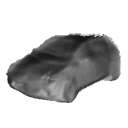
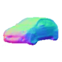
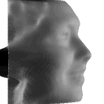

# **COMP6248-Reproducibility Challenge**
## Do 2D GANs Know 3D Shape? Unsupervised 3D Shape Reconstruction from 2D Image GANs
### Results Show
<figure class="fourth">

</figure>

### Team Members
Yangyu Song

Meixuan Song

Yuzhe Chen

Zhuhao Zhou
### Requirements
- python >=3.6
- Pytorch = 1.2

	`pip install https://download.pytorch.org/whl/cu100/torch-1.2.0-cp36-cp36m-manylinux1_x86_64.whl`

- Torchvision = 0.4.0

	`pip install https://download.pytorch.org/whl/cu100/torchvision-0.4.0-cp36-cp36m-manylinux1_x86_64.whl`

- MMCV=1.2.7

	`pip install mmcv==1.2.7`

- Neural renderer

	`pip install neural_renderer_pytorch`
	
	or

	`pip install git+https://github.com/ZhengZerong/neural_renderer.git`

- Other libraies

	`pip install scikit-image matplotlib moviepy pyyaml tensorboardX`

- CUDA=9.2

	`wget https://developer.nvidia.com/compute/cuda/9.2/Prod2/local_installers/cuda-repo-ubuntu1604-9-2-local_9.2.148-1_amd64`

	`sudo dpkg -i /content/cuda-repo-ubuntu1604-9-2-local_9.2.148-1_amd64`

	`sudo apt-key add /var/cuda-repo-9-2-local/7fa2af80.pub`

	`sudo apt-get update`

	`sudo apt-get install cuda **cuda-9-2**`

### Training
- Clone code of GAN2Shape

	`git clone https://github.com/XingangPan/GAN2Shape.git`

- To download dataset and pre-trained weights

	`cd ./gan2shape`

	`sh scripts/download.sh`

- Running training (GPU)

	1. car:	`sh scripts/run_car.sh`
	2. cat:	`sh scripts/run_cat.sh`
	3. church:	`sh scripts/run_church.sh`
	4. celebrity:	`sh scripts/run_celeba.sh`
- Running Pre-training

	1. car:	`sh scripts/run_car-pre.sh`
	2. cat:	`sh scripts/run_cat-pre.sh`
	3. church:	`sh scripts/run_church-pre.sh`
	4. celebrity:	`sh scripts/run_celeba-pre.sh`

### Resources
- Reproduced from ICLR 2021 Conference Paper: https://openreview.net/forum?id=FGqiDsBUKL0
- Github Page: https://github.com/XingangPan/GAN2Shape
